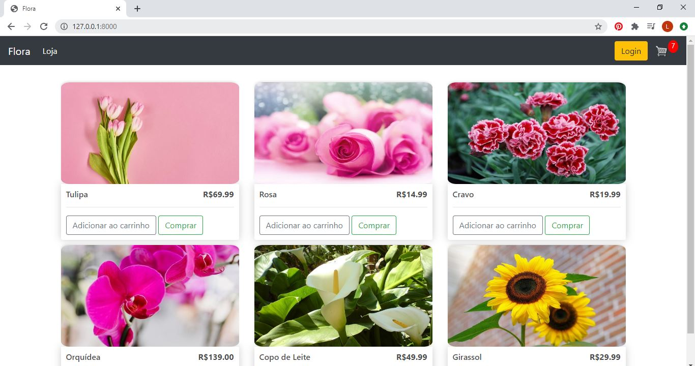
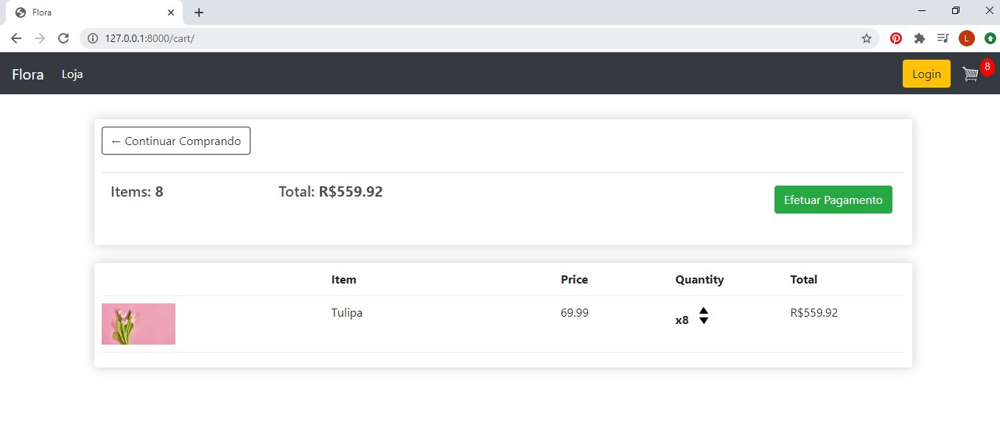
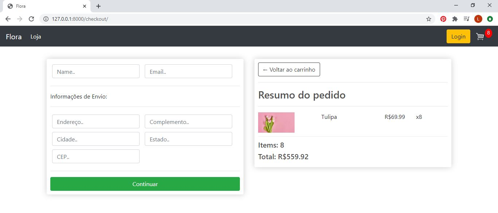
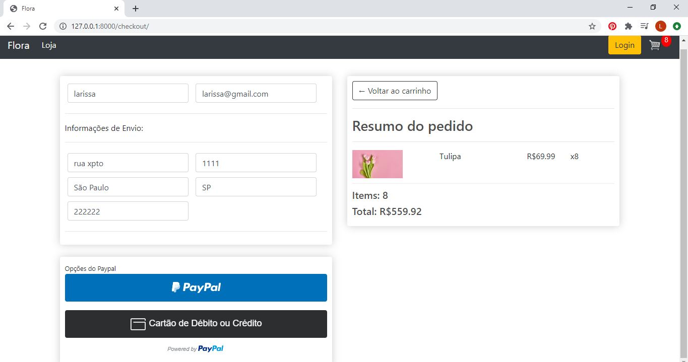

# Projeto
Loja E-commerce

## Pré-Requisitos
Estas instruções fornecerão uma cópia do projeto instalado em sua máquina local para verificar sua funcionalidade.

### Versões utilizadas 
Python == 3.8.2  
Django==3.0.8  
Pillow==7.2.0   

### Instalando  
Abra o terminal e digite:  
git clone https://github.com/laryike/Projeto-ecommerce-django.git

### Migrar o banco de dados com os comandos:  
python manage.py makemigrations  
python manage.py migrate 

### Criar um usuário
python manage.py createsuperuser

### Executar o programa na máquina local
python manage.py runserver  
E então abrir o link http://127.0.0.1:8000 em seu browser

## Imagens das telas 
### Loja

### Carrinho

### Efetuar pagamento

